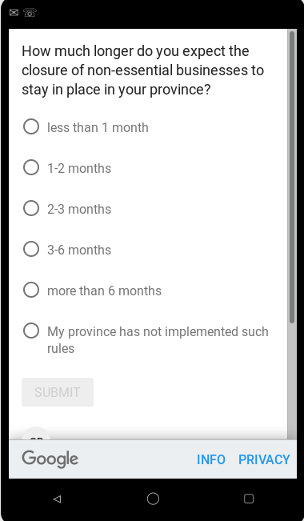

Data from a survey of consumer expectations

## Description

From April 24, 2020, Fabian Lange and Lars Vilhuber will conduct the survey "Uncertainty in COVID-19 times". The survey is a single-question survey focusing on people's anticipation about social distancing rules and firm closures during the 2020 COVID-19 health crisis. 

We believe that this information is not otherwise available in a reliable and timely fashion. The information should be usable by policy-makers and researchers, to be included in models of future developments of society and the economy.

### Citation

Please cite the data as 

> Lange, Fabian and Lars Vilhuber. 2020. "Expectations about Continuation of Social Distancing Rules in COVID-19 Times [dataset]." (this URL)

We will be posting the data on Zenodo shortly. Data should be cite via DOI then.

## List of files {.tabset .tabset-fade}

### Final files

Final files are uploaded after each wave is completed. Filenames in [`final`](final/) tagged with geography, language, the question type,and date downloaded:

> `survey-[geography]-[language]-[question]-[date].xlsx`

|Files                                                                                        |
|:--------------------------------------------------------------------------------------------|
|[survey-canada-fr-businesses-20200426.xlsx](final/survey-canada-fr-businesses-20200426.xlsx) |
|[survey-canada-fr-people-20200426.xlsx](final/survey-canada-fr-people-20200426.xlsx)         |
|[survey-qc-fr-businesses-20200429.xlsx](final/survey-qc-fr-businesses-20200429.xlsx)         |
|[survey-qc-fr-people-20200429.xlsx](final/survey-qc-fr-people-20200429.xlsx)                 |
|[survey-us-en-businesses-20200429.xlsx](final/survey-us-en-businesses-20200429.xlsx)         |
|[survey-us-en-people-20200429.xlsx](final/survey-us-en-people-20200429.xlsx)                 |

### Temporary files

[`Temporary`](temporary/) files follow

> `survey-[surveyid].xlsx`

## Data description

|  Topic | Answer |
|--------|--------|
| Geographic Coverage | United States of America, Canada |
| Time  Periods | 2020-04-24 - 2020-04-28. |
| Date of Collection | 2020-04-24 - 2020-04-28. |
| Unit of Observation | Individual |
| Description of Variables | User ID, Time (UTC), Survey Completion, Publisher Category, Gender, Age, Geography, Weight, Question #1 Answer, Response Time #1 (ms) |

### Reference period

The survey asks about point-in-time expectations. A new wave is launched every Friday. The list below provides the dates of collection for each wave. Currently, data are available covering the period between 2020-04-24 and 2020-04-28.

<!--html_preserve-->

<!--/html_preserve-->

### Data Dictionary

#### Q1: Answer to primary question {.tabset .tabset-fade}

This field will differ across the two types of files, geography, and languages. A consolidated (standardized) distribution is shown below, using the [standardizer mapping](auxiliary/standardize_values.xlsx).

##### Standardized distribution

<!-- -->

##### Business, Canada, French

Question #1 Answer                                      count   percent
-----------------------------------------------------  ------  --------
1-2 mois                                                  277     30.64
2-3 mois                                                  250     27.65
3-6 mois                                                  201     22.23
Les entreprises dans ma province ne sont pas fermées       17      1.88
moins d'un mois                                           104     11.50
plus que 6 mois                                            55      6.08

##### People, Canada, French

Question #1 Answer                       count   percent
--------------------------------------  ------  --------
1-2 mois                                   175     21.06
2-3 mois                                   212     25.51
3-6 mois                                   230     27.68
Ma province n'a pas de telles mesures        8      0.96
moins d'un mois                             27      3.25
plus que 6 mois                            179     21.54

##### Business, US, English

Question #1 Answer                          count   percent
-----------------------------------------  ------  --------
1-2 months                                    916     36.63
2-3 months                                    279     11.16
3-6 months                                    149      5.96
less than 1 month                             857     34.27
more than 6 months                            136      5.44
My state has not implemented such rules.      164      6.56

##### People, US, English

Question #1 Answer                          count   percent
-----------------------------------------  ------  --------
1-2 months                                    811     32.43
2-3 months                                    344     13.75
3-6 months                                    275     11.00
less than 1 month                             578     23.11
more than 6 months                            319     12.75
My state has not implemented such rules.      174      6.96

(TO BE FILLED OUT)

#### Age

Age        count   percent
--------  ------  --------
18-24        912     13.54
25-34       1029     15.27
35-44        986     14.64
45-54        805     11.95
55-64        859     12.75
65+          730     10.84
Unknown     1416     21.02

#### Gender

Gender     count   percent
--------  ------  --------
Female      2637     39.14
Male        2770     41.12
Unknown     1330     19.74

#### Geography {.tabset .tabset-fade}

Geography is as coded by Google Surveys. Precision may vary, having country, region, province, and sometimes city.

Distribution across countries

<!--html_preserve-->

<!--/html_preserve-->

##### Regions

Regions may be single states or provinces, or larger collections.

<!--html_preserve-->

<!--/html_preserve-->

##### States/Provinces

<!--html_preserve-->

<!--/html_preserve-->

##### Cities

In some cases, details is available at the city level.

<!--html_preserve-->

<!--/html_preserve-->

##### Detailed geography

<!--html_preserve-->

<!--/html_preserve-->

#### Weight

See elsewhere in this document how weights are computed.

<!--html_preserve-->

<!--/html_preserve-->

#### Response Time

<!--html_preserve-->

<!--/html_preserve-->

#### Publisher Category

<!--html_preserve-->

<!--/html_preserve-->

#### Not tabulated

- `User ID`
- `Time (UTC)`
- `Survey Completion`

### Data structure

Data files are available for each completed cycle of the survey, in general once a week, and are stored under [`final`](final/). Data from the preliminary study (assessing the questionnaire design) is stored under [`preliminary`](preliminary/). We may make available data before the survey is completed for each cycle, under [`temporary`](temporary/), however, once the final version from that cycle is available, these are deleted (this directory will be empty on Zenodo).

### Data format

Native format is Excel (XLSX). 

Files are provided as downloaded from Google Surveys. Each file has 4 tabs.

#### Overview

Lists the questions asked by the client, in this case Lange and Vilhuber, as well as a survey ID.

#### Topline

This tab contains a weighted summary of the responses to the questions (similar to the above summary). 

#### Complete responses

This tab contains the actual microdata for any complete responses. Note that for a single-question survey, this is identical to the "All responses". A complete response might have a weight of zero.

#### All responses

All responses, whether complete or not, are recorded on this tab. In the case of a single-question survey, this is identical to the "Complete responses" tab.

## Data sources and methodology  

### Target population

- All Canadians aged 18 and older from the ten provinces and three territories are eligible to participate.
- All US residents aged 18 and older are eligible to participate.

### Instrument design  

Each individual is asked one of two questions: how long they expect "social distancing rules" or "business closures" to remain in effect:

- How much longer do you expect social distancing rules (restrictions on gatherings, stay-at-home rules) to stay in place in your province/state?
- How much longer do you expect the closure of non-essential businesses to stay in place in your province/state?

Five response choices are offered: 

- "less than 1 month", 
- "1-2 months", 
- "2-3 months", 
- "3-6 months", 
- "more than 6 months". 

An additional answer allows respondents to affirm that "such measures are not implemented in their province/state". See [questionnaires](#questionnaires) for visual representation of the questions. 

### Questionnaires

### Data collection

Data is collected via Google Surveys. For English-language surveys, data is collected via a web form. For French-language surveys, the Android Google Survey app is used, as web-collection in French is not possible via Google Surveys. See @sostek_how_2018 and @google_methodology_2020 for more details.

### Sampling

Google Surveys is an online non-probability survey. It uses  stratified sampling for collection, based (in the US) on the target internet population from the  2017 Current Population Survey (CPS) Computer and Internet Use Supplement [@sostek_how_2018;@google_methodology_2020]. 

Data are collected directly from survey respondents.

For each country, we plan to collect 2500 responses per question, per week. For Canada, a French-language variant is fielded. In order to determine the split, we use Statistics Canada statistics on "Languag
e spoken most often at home" by other language(s) spoken regularly at home and age" [@statistics_canada_language_2017],^[Table can be downloaded from [here](https://www12.statcan.gc.ca/census-recensement/2016/dp-pd/hlt-fst/lang/Tables/Download/_file.cfm?Lang=E&T=31&Geo=00&SP=1&view=1&age=1&rl=1&OFT=csv).] combining responses for "French" and "French and non-official language" (i.e., no English mentioned).

For 2016, 20.4% spoke French and no English as the language spoken most often at home. We thus target 510 responses via the French-language questionnaire, and 1990 in English.

### Imputation

All demographics are imputed by Google Surveys, if collected via web. Demographics for respondents via the app are collected through the app. 

### Quality evaluation

A preliminary survey was conducted to allow for choice of either a two-question variant, or a one-question variant that incluced both social distancing and business closures ("How much longer do you expect social distancing rules (restrictions on gatherings, closure of non-essential businesses, stay-at-home rules) to stay in place in your province?"). See "[Uncertainty in times of COVID-19: Choosing whether to ask 1 or 2 questions](evaluation.md)" for more information. 

### Privacy and disclosure control

Privacy and disclosure control are described in @google_methodology_2020. For most respondents, no direct or indirect identifiers are collected, and are imputed based on other information available to Google, but not the sponsors of the survey. 

### Response rates

The specific response rates are not known. @google_methodology_2020 reports response rates in general for this type of data collection.

## References

