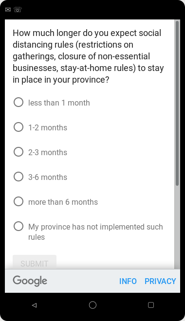

## Purpose

We fielded three questions regarding uncertainty in the April 2020 COVID-19 situation in Canada. Goal is to select either a two-question survey, using different questions for employment and consumer behavior, or a composite question that encompasses both. The question is whether answers between the two-question version differ between questions. The composite question was asked as a control. 


## Sources {.tabset .tabset-fade}

We [pre-registered](https://osf.io/729nr) the decision based on **preliminary data** collected after the first day of fielding the question (on 20200421). The decision about choice of the question, as well as preliminary descriptive results, are  based on **test data** collected over the entire test time period, with a target n of 250 per question. We collected data from 2020-04-12 to 2020-04-17 across Canada, achieving a total *n*=753.

The data was manually downloaded from the Google Consumer Survey site on 20200412, and saved, using the  naming convention `tag-YYYYMMDD-HHMM.xlsx`. Data used for both the original design and the full test time period are available in this archive.

### Preliminary data files

<!--html_preserve--><div id="htmlwidget-419be8a7575bf547dd4a" style="width:100%;height:auto;" class="datatables html-widget"></div>
<script type="application/json" data-for="htmlwidget-419be8a7575bf547dd4a">{"x":{"filter":"none","autoHideNavigation":true,"data":[["1","2","3"],["preliminary/survey-business-20200412-1044.xlsx","preliminary/survey-composite-20200412-1044.xlsx","preliminary/survey-people-20200412-1044.xlsx"],["20200412","20200412","20200412"],["1044","1044","1044"],["business","composite","people"]],"container":"<table class=\"display\">\n  <thead>\n    <tr>\n      <th> <\/th>\n      <th>Preliminary files<\/th>\n      <th>date<\/th>\n      <th>time<\/th>\n      <th>tag<\/th>\n    <\/tr>\n  <\/thead>\n<\/table>","options":{"dom":"t","order":[],"autoWidth":false,"orderClasses":false,"columnDefs":[{"orderable":false,"targets":0}]}},"evals":[],"jsHooks":[]}</script><!--/html_preserve-->

### Test data files

<!--html_preserve--><div id="htmlwidget-429e4ddd915e7ef39ee4" style="width:100%;height:auto;" class="datatables html-widget"></div>
<script type="application/json" data-for="htmlwidget-429e4ddd915e7ef39ee4">{"x":{"filter":"none","autoHideNavigation":true,"data":[["1","2","3"],["preliminary/survey-business-20200421-1520.xlsx","preliminary/survey-composite-20200421-1520.xlsx","preliminary/survey-people-20200421-1520.xlsx"],["20200421","20200421","20200421"],["1520","1520","1520"],["business","composite","people"]],"container":"<table class=\"display\">\n  <thead>\n    <tr>\n      <th> <\/th>\n      <th>Preliminary files<\/th>\n      <th>date<\/th>\n      <th>time<\/th>\n      <th>tag<\/th>\n    <\/tr>\n  <\/thead>\n<\/table>","options":{"dom":"t","order":[],"autoWidth":false,"orderClasses":false,"columnDefs":[{"orderable":false,"targets":0}]}},"evals":[],"jsHooks":[]}</script><!--/html_preserve-->


## Fielded questions 

We fielded three questions in the test sample:

- How much longer do you expect social distancing rules (restrictions on gatherings, stay-at-home rules) to stay in place in your province?
- How much longer do you expect the closure of non-essential businesses to stay in place in your province?
- How much longer do you expect social distancing rules (restrictions on gatherings, closure of non-essential businesses, stay-at-home rules) to stay in place in your province?

For each question, we collected responses on a Likert scale with text: "less than 1 month", "1-2 months", "2-3 months", "3-6 months", "more than 6 months", and a response equivalent to "does not apply" ("My province has not implemented such rules.").




## First results {.tabset .tabset-fade}

### Total observation by tag / question


tag         date        count
----------  ---------  ------
business    20200421      251
composite   20200421      251
people      20200421      251


### Responses to Question 1


Q1                                             count   percent
--------------------------------------------  ------  --------
less than 1 month                                 25      9.96
1-2 months                                        77     30.68
2-3 months                                        55     21.91
3-6 months                                        39     15.54
more than 6 months                                37     14.74
My province has not implemented such rules.       18      7.17

### Responses to Question 2


Q1                                             count   percent
--------------------------------------------  ------  --------
less than 1 month                                 28     11.16
1-2 months                                        74     29.48
2-3 months                                        54     21.51
3-6 months                                        44     17.53
more than 6 months                                24      9.56
My province has not implemented such rules.       27     10.76

### Responses to Question 3


Q1                                             count   percent
--------------------------------------------  ------  --------
less than 1 month                                 24      9.56
1-2 months                                        69     27.49
2-3 months                                        55     21.91
3-6 months                                        38     15.14
more than 6 months                                37     14.74
My province has not implemented such rules.       28     11.16

## Do the different questions yield different responses? {.tabset .tabset-fade}


### Visually

<!-- -->

### Kolmogorov-Smirnov Test


```
## 
## 	Two-sample Kolmogorov-Smirnov test
## 
## data:  hist.business and hist.people
## D = 0.16667, p-value = 1
## alternative hypothesis: two-sided
```

In the Kolmogorov-Smirnov test, the entire (cumulative) distribution is tested for equality. The hypothesis of equality of distributions 
is rejected when the test statistic $D$  is larger than $c(\alpha) \sqrt{\frac{n+m}{n*m}}$ where $n$ and $m$ are the sample sizes. 

For the full test data, $n=$ 251 and $m=$ 251, the square root evaluates to 0.0892644. The test statistic $D=$ 0.1666667, with a p-value of 1. Based on the KS test, we thus  reject the hypothesis of equality of distributions.


### Single-dimensional test


Alternatively, we can compute a $z$-test for the  proportion responding to Q1 with "1-2 months", with the remaining fractions collapsed to an "other" category. For the test sample, these numbers are 29.4820717 percent for the `business`  version, and 30.6772908 percent for the `people` version. The $\chi^2$ statistic has a value of 0.0378861 and a p-value of 0.8456721. Based on the $z$-test, we cannot  reject the hypothesis of equality of responses to Q1. For the (non-pre-registered) comparison of the fraction responding with "more than 6 months", the $\chi^2$ statistic has a value of 2.6871863 and a p-value of 0.1011583.

The test has power of 0.05 for the sample size n=251 and effect size 9.56 at $\alpha =$ 0.05.

### Fisher's exact test


```
## 
## 	Fisher's Exact Test for Count Data with simulated p-value (based on
## 	10000 replicates)
## 
## data:  hist.business and hist.people
## p-value = 1
## alternative hypothesis: two.sided
```
We can also use Fisher's exact test to assess whether the two distributions are different. The null hypothesis is that the rows *and* columns of the two histograms are independent (i.e., the two distributions are different).
Fisher's test when applied to the test sample gives a p-value of 1, so the null that the two distributions are different  should be  rejected.

### $\chi^2$ test


```
## 
## 	Pearson's Chi-squared test with simulated p-value (based on 10000
## 	replicates)
## 
## data:  hist.business and hist.people
## X-squared = 30, df = NA, p-value = 1
```

Finally, a $\chi^2$ test of independence of distributions yields a test statistic of 30 and a p-value of 1, not rejecting the null that the two histograms are different.


## Decision Criterion

We will use one composite question if the two variants (`business` and `people`) are not statistically different in our test sample, according to the majority of tests.

## Results

Based on the observed data from the test data collected  between 2020-04-12 and 2020-04-17 across Canada, we chose the two-question version.
