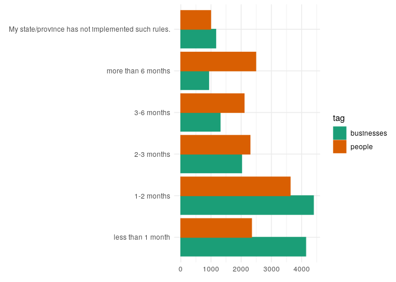
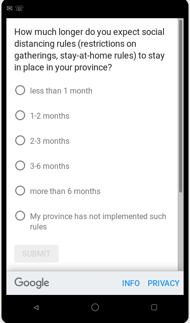
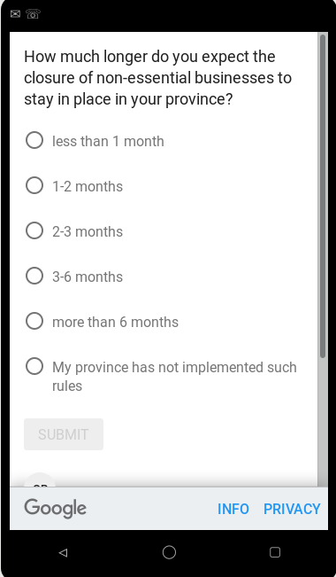

Data from a survey of consumer expectations

## Description

Since April 24, 2020, [Fabian Lange](http://www.fabianlange.ca/) and [Lars Vilhuber](https://lars.vilhuber.com) have been conducting the survey "Uncertainty in COVID-19 times". The survey is a single-question survey focusing on people's anticipation about social distancing rules and firm closures during the 2020 COVID-19 health crisis. 

We believe that this information is not otherwise available in a reliable and timely fashion. The information should be usable by policy-makers and researchers, to be included in models of future developments of society and the economy.

### Citation

Please cite the data as 

> Lange, Fabian and Lars Vilhuber. 2020. "Uncertainty in times of COVID-19: Raw survey data [dataset]." Available at https://labordynamicsinstitute.github.io//covid19-expectations-data (accessed 2020-06-22).

Please cite this document as

> Lange, Fabian and Lars Vilhuber. 2020. "Codebook for: Uncertainty in times of COVID-19: Raw survey data." Available at https://labordynamicsinstitute.github.io//covid19-expectations-data (accessed 2020-06-22).

This document is also available in PDF format at <a href="https://labordynamicsinstitute.github.io//covid19-expectations-data/expectations-codebook.pdf">https://labordynamicsinstitute.github.io//covid19-expectations-data/expectations-codebook.pdf</a>.

We will be posting the data on Zenodo shortly. Data should be cite via DOI then.

## Available data {.tabset .tabset-fade}

### Final files

Final files are uploaded after each wave is completed. Filenames in [`final`](final/) tagged with geography, language, the question type,and date downloaded:

> `survey-[geography]-[language]-[question]-[date].xlsx`

### List of files

|Files                                                                                        |
|:--------------------------------------------------------------------------------------------|
|[survey-canada-en-businesses-20200506.xlsx](final/survey-canada-en-businesses-20200506.xlsx) |
|[survey-canada-en-businesses-20200508.xlsx](final/survey-canada-en-businesses-20200508.xlsx) |
|[survey-canada-en-businesses-20200515.xlsx](final/survey-canada-en-businesses-20200515.xlsx) |
|[survey-canada-en-businesses-20200522.xlsx](final/survey-canada-en-businesses-20200522.xlsx) |
|[survey-canada-en-businesses-20200529.xlsx](final/survey-canada-en-businesses-20200529.xlsx) |
|[survey-canada-en-businesses-20200605.xlsx](final/survey-canada-en-businesses-20200605.xlsx) |
|[survey-canada-en-businesses-20200612.xlsx](final/survey-canada-en-businesses-20200612.xlsx) |
|[survey-canada-en-businesses-20200619.xlsx](final/survey-canada-en-businesses-20200619.xlsx) |
|[survey-canada-en-people-20200503.xlsx](final/survey-canada-en-people-20200503.xlsx)         |
|[survey-canada-en-people-20200508.xlsx](final/survey-canada-en-people-20200508.xlsx)         |
|[survey-canada-en-people-20200515.xlsx](final/survey-canada-en-people-20200515.xlsx)         |
|[survey-canada-en-people-20200522.xlsx](final/survey-canada-en-people-20200522.xlsx)         |
|[survey-canada-en-people-20200529.xlsx](final/survey-canada-en-people-20200529.xlsx)         |
|[survey-canada-en-people-20200605.xlsx](final/survey-canada-en-people-20200605.xlsx)         |
|[survey-canada-en-people-20200612.xlsx](final/survey-canada-en-people-20200612.xlsx)         |
|[survey-canada-fr-businesses-20200426.xlsx](final/survey-canada-fr-businesses-20200426.xlsx) |
|[survey-canada-fr-people-20200426.xlsx](final/survey-canada-fr-people-20200426.xlsx)         |
|[survey-ny-en-businesses-20200512.xlsx](final/survey-ny-en-businesses-20200512.xlsx)         |
|[survey-ny-en-businesses-20200527.xlsx](final/survey-ny-en-businesses-20200527.xlsx)         |
|[survey-ny-en-people-20200513.xlsx](final/survey-ny-en-people-20200513.xlsx)                 |
|[survey-ny-en-people-20200527.xlsx](final/survey-ny-en-people-20200527.xlsx)                 |
|[survey-qc-fr-businesses-20200429.xlsx](final/survey-qc-fr-businesses-20200429.xlsx)         |
|[survey-qc-fr-businesses-20200503.xlsx](final/survey-qc-fr-businesses-20200503.xlsx)         |
|[survey-qc-fr-businesses-20200510.xlsx](final/survey-qc-fr-businesses-20200510.xlsx)         |
|[survey-qc-fr-businesses-20200517.xlsx](final/survey-qc-fr-businesses-20200517.xlsx)         |
|[survey-qc-fr-businesses-20200524.xlsx](final/survey-qc-fr-businesses-20200524.xlsx)         |
|[survey-qc-fr-businesses-20200530.xlsx](final/survey-qc-fr-businesses-20200530.xlsx)         |
|[survey-qc-fr-businesses-20200607.xlsx](final/survey-qc-fr-businesses-20200607.xlsx)         |
|[survey-qc-fr-businesses-20200614.xlsx](final/survey-qc-fr-businesses-20200614.xlsx)         |
|[survey-qc-fr-people-20200429.xlsx](final/survey-qc-fr-people-20200429.xlsx)                 |
|[survey-qc-fr-people-20200503.xlsx](final/survey-qc-fr-people-20200503.xlsx)                 |
|[survey-qc-fr-people-20200510.xlsx](final/survey-qc-fr-people-20200510.xlsx)                 |
|[survey-qc-fr-people-20200517.xlsx](final/survey-qc-fr-people-20200517.xlsx)                 |
|[survey-qc-fr-people-20200524.xlsx](final/survey-qc-fr-people-20200524.xlsx)                 |
|[survey-qc-fr-people-20200529.xlsx](final/survey-qc-fr-people-20200529.xlsx)                 |
|[survey-qc-fr-people-20200607.xlsx](final/survey-qc-fr-people-20200607.xlsx)                 |
|[survey-qc-fr-people-20200614.xlsx](final/survey-qc-fr-people-20200614.xlsx)                 |
|[survey-us-en-businesses-20200429.xlsx](final/survey-us-en-businesses-20200429.xlsx)         |
|[survey-us-en-businesses-20200503.xlsx](final/survey-us-en-businesses-20200503.xlsx)         |
|[survey-us-en-businesses-20200511.xlsx](final/survey-us-en-businesses-20200511.xlsx)         |
|[survey-us-en-businesses-20200517.xlsx](final/survey-us-en-businesses-20200517.xlsx)         |
|[survey-us-en-businesses-20200524.xlsx](final/survey-us-en-businesses-20200524.xlsx)         |
|[survey-us-en-businesses-20200601.xlsx](final/survey-us-en-businesses-20200601.xlsx)         |
|[survey-us-en-businesses-20200607.xlsx](final/survey-us-en-businesses-20200607.xlsx)         |
|[survey-us-en-businesses-20200614.xlsx](final/survey-us-en-businesses-20200614.xlsx)         |
|[survey-us-en-people-20200429.xlsx](final/survey-us-en-people-20200429.xlsx)                 |
|[survey-us-en-people-20200504.xlsx](final/survey-us-en-people-20200504.xlsx)                 |
|[survey-us-en-people-20200510.xlsx](final/survey-us-en-people-20200510.xlsx)                 |
|[survey-us-en-people-20200517.xlsx](final/survey-us-en-people-20200517.xlsx)                 |
|[survey-us-en-people-20200525.xlsx](final/survey-us-en-people-20200525.xlsx)                 |
|[survey-us-en-people-20200601.xlsx](final/survey-us-en-people-20200601.xlsx)                 |
|[survey-us-en-people-20200609.xlsx](final/survey-us-en-people-20200609.xlsx)                 |

### Normalized files

We provide a normalized Stata and R (`Rds`) file with all surveys, recoded consistently.

|Files                                        |
|:--------------------------------------------|
|[expectations.csv](derived/expectations.csv) |
|[expectations.dta](derived/expectations.dta) |
|[expectations.Rds](derived/expectations.Rds) |

### Auxiliary files

We provide additional files that were either used or generated in the process of data cleaning, in particular for the reweighting. (explanations to come)

|Files                                                                          |
|:------------------------------------------------------------------------------|
|[aggregage_agegrp_ca.xlsx](auxiliary/aggregage_agegrp_ca.xlsx)                 |
|[reweights_aux_ca.csv](auxiliary/reweights_aux_ca.csv)                         |
|[reweights_aux_ca.dta](auxiliary/reweights_aux_ca.dta)                         |
|[reweights_aux_ca.Rds](auxiliary/reweights_aux_ca.Rds)                         |
|[reweights_aux_us.csv](auxiliary/reweights_aux_us.csv)                         |
|[reweights_aux_us.dta](auxiliary/reweights_aux_us.dta)                         |
|[reweights_aux_us.Rds](auxiliary/reweights_aux_us.Rds)                         |
|[standardize_values.xlsx](auxiliary/standardize_values.xlsx)                   |
|[statcan_regions_2011_table8.xlsx](auxiliary/statcan_regions_2011_table8.xlsx) |
|[state-geocodes-v2017.xlsx](auxiliary/state-geocodes-v2017.xlsx)               |
### Temporary files

Temporary files may be made available if a survey has not yet completed, but data are already available. 

[`Temporary`](temporary/) files follow

> `survey-[surveyid].xlsx`

## Data description

|  Topic | Answer |
|--------|--------|
| Geographic Coverage | United States of America, Canada |
| Time  Periods | 2020-04-24 - 2020-06-19 |
| Date of Collection | 2020-04-24 - 2020-06-19 |
| Unit of Observation | Individual |
| Description of Variables | User_ID, Time_UTC, Survey_Completion, Publisher_Category, Gender, Age, Geography, Weight, Question_1_Answer, rt_Q1_ms |

### Reference period

The survey asks about point-in-time expectations. A new wave is launched every Friday. The list  provides the dates of collection for each wave. Currently, data are available covering the period between 2020-04-24 and 2020-06-19.

<!--html_preserve-->

<!--/html_preserve-->

### Data Dictionary

#### Q1: Answer to primary question {.tabset .tabset-fade}

This field captures the answer to the [sole question of each survey](#question-type), where answers differ across geographic scope (`geotag`), and languages. A consolidated (standardized) distribution is shown below, using the [standardizer mapping](auxiliary/standardize_values.xlsx).

##### Standardized distribution

The following tabulations are of unweighted data.

<!-- -->

##### People, Canada, English

Question_1_Answer                              count   percent
--------------------------------------------  ------  --------
1-2 months                                      2561     21.23
2-3 months                                      2015     16.71
3-6 months                                      1986     16.46
less than 1 month                               1559     12.92
more than 6 months                              2674     22.17
My province has not implemented such rules.     1267     10.50

##### Business, Canada, French

Question_1_Answer                                       count   percent
-----------------------------------------------------  ------  --------
1-2 mois                                                 1553     30.66
2-3 mois                                                 1071     21.14
3-6 mois                                                  769     15.18
Les entreprises dans ma province ne sont pas fermées      236      4.66
moins d'un mois                                          1130     22.31
plus que 6 mois                                           307      6.06

##### People, Canada, French

Question_1_Answer                        count   percent
--------------------------------------  ------  --------
1-2 mois                                   842     17.02
2-3 mois                                   965     19.51
3-6 mois                                  1334     26.97
Ma province n'a pas de telles mesures       27      0.55
moins d'un mois                            269      5.44
plus que 6 mois                           1509     30.51

##### Business, US, English

Question_1_Answer                           count   percent
-----------------------------------------  ------  --------
1-2 months                                   5046     25.11
2-3 months                                   1918      9.55
3-6 months                                   1293      6.44
less than 1 month                            8365     41.63
more than 6 months                           1306      6.50
My state has not implemented such rules.     2165     10.77

##### People, US, English

Question_1_Answer                           count   percent
-----------------------------------------  ------  --------
1-2 months                                   4131     23.57
2-3 months                                   2411     13.76
3-6 months                                   2379     13.57
less than 1 month                            3894     22.22
more than 6 months                           3228     18.42
My state has not implemented such rules.     1485      8.47

#### Question type {.tabset .tabset-fade}

The actual question asked is encoded in the `tag` variable on [normalized files](#normalized-files), and differs by [geographic target](#geographic-target) (`geotag`). On the original files, geographic target is not identifiable except through the file name, and the question text is on the "Overview" tab. On the [normalized files](#normalized-files), the variables `tag` and `geotag` allow to map back to the actual question:

<!--html_preserve-->

<!--/html_preserve-->

##### Geographic target

Encoded in `geotag` on [normalized files](#normalized-files), and specifies the two-letter geocode (country or postal abbreviation) as targeted on the Google Survey platform. Note: `geotag` = `qc` also identifies the surveys that used the app.

geotag    count   percent
-------  ------  --------
canada    26768     35.56
ny         2003      2.66
qc         8890     11.81
us        37621     49.97

##### Notes

- in Week 1 (2020-04-24), we ran  a French-language app survey geo-targeted for Canada, and another one targeted at Québec only. In subsequent weeks, we ran the French-language app survey only in Québec.
- in Week 3 (2020-05-10), we ran a supplementary web survey geo-targeted at New York State.

#### Age

Age        count   percent
--------  ------  --------
18-24       9670     12.85
25-34      12348     16.40
35-44      10660     14.16
45-54       9303     12.36
55-64       9305     12.36
65+         8902     11.82
Unknown    15094     20.05

#### Gender

Gender     count   percent
--------  ------  --------
Female     28419     37.75
Male       32794     43.56
Unknown    14069     18.69

#### Geography {.tabset .tabset-fade}

Geography is as coded by Google Surveys. Precision may vary, having country, region, province, and sometimes city. Note that this may be different from the [targeted geography](#geographic-target).

##### Detailed geography

The variable `Geography` corresponds to the geography as captured and recorded by Google. All other geography variables are derived from this variable, and are only available on the [normalized files](#normalized-files).

<!--html_preserve-->

<!--/html_preserve-->

##### Country

Distribution across countries

<!--html_preserve-->

<!--/html_preserve-->

##### Region

Regions may be single states or provinces, or larger collections. They may correspond to US Census regions or [Statistics Canada regions](https://www12.statcan.gc.ca/census-recensement/2011/ref/dict/table-tableau/table-tableau-8-eng.cfm).

<!--html_preserve-->

<!--/html_preserve-->

##### States/Province

States and provinces are codes as two-letter postal abbreviation on the original data files. On derived files, `geonum`  contains the numeric FIPS or [province code](https://www12.statcan.gc.ca/census-recensement/2011/ref/dict/table-tableau/table-tableau-8-eng.cfm) (coded as character to preserve leading zeros), and as a full name (`geoname`). Note that the Google-provided `Region` often, but not always corresponds to a state or province, whereas `State_Province`, `geonum`, `geoname` always correspond to state/province.

<!--html_preserve-->

<!--/html_preserve-->

##### City

In some cases, details is available at the city level.

<!--html_preserve-->

<!--/html_preserve-->

#### Weight

See [elsewhere in this document](#weighting) how weights are computed.

<!--html_preserve-->

<!--/html_preserve-->

#### Response Time

<!--html_preserve-->

<!--/html_preserve-->

#### Publisher Category

<!--html_preserve-->

<!--/html_preserve-->

#### Not tabulated

- `User_ID`
- `Time_UTC`
- `Survey_Completion`

### Data structure

Data files are available for each completed cycle of the survey, in general once a week, and are stored under [`final`](final/). Data from the preliminary study (assessing the questionnaire design) is stored under [`preliminary`](preliminary/). We may make available data before the survey is completed for each cycle, under [`temporary`](temporary/), however, once the final version from that cycle is available, these are deleted (this directory will be empty on Zenodo).

### Data format

Native format is Office Open XML (XLSX, @ecma_international_standard_2016 ). Normalized files are available in Stata and R formats.

Files are provided as downloaded from Google Surveys. Each file has 4 tabs.

#### Overview

Lists the questions asked by the client, in this case Lange and Vilhuber, as well as a survey ID.

#### Topline

This tab contains a weighted summary of the responses to the questions (similar to the above summary). 

#### Complete responses

This tab contains the actual microdata for any complete responses. Note that for a single-question survey, this is identical to the "All responses". A complete response might have a weight of zero.

#### All responses

All responses, whether complete or not, are recorded on this tab. In the case of a single-question survey, this is identical to the "Complete responses" tab.

## Data sources and methodology  

### Target population

- All Canadians aged 18 and older from the ten provinces and three territories are eligible to participate.
- All US residents aged 18 and older are eligible to participate.

### Instrument design  

Each individual is asked one of two questions: how long they expect "social distancing rules" or "business closures" to remain in effect:

- How much longer do you expect social distancing rules (restrictions on gatherings, stay-at-home rules) to stay in place in your province/state?
- How much longer do you expect the closure of non-essential businesses to stay in place in your province/state?

Five response choices are offered: 

- "less than 1 month", 
- "1-2 months", 
- "2-3 months", 
- "3-6 months", 
- "more than 6 months". 

An additional answer allows respondents to affirm that "such measures are not implemented in their province/state". See [questionnaires](#questionnaires) for visual representation of the questions. 

### Questionnaires

### Data collection

Data is collected via Google Surveys. For English-language surveys, data is collected via a web form. For French-language surveys, the Android Google Survey app is used, as web-collection in French is not possible via Google Surveys. See @sostek_how_2018 and @google_methodology_2020 for more details.

The survey questionnaire was approved by McGill University Research Ethics Board under REB File # 20-04-070. Exemption was issued by Cornell University Institutional Review Board under Protocol ID# 2004009539.

### Sampling

Google Surveys is an online non-probability survey. It uses  stratified sampling for collection, based (in the US) on the target internet population from the  2017 Current Population Survey (CPS) Computer and Internet Use Supplement [@sostek_how_2018;@google_methodology_2020]. 

Data are collected directly from survey respondents.

For each country, we plan to collect 2500 responses per question, per week. For Canada, a French-language variant is fielded. In order to determine the split, we use Statistics Canada statistics on "Languag
e spoken most often at home" by other language(s) spoken regularly at home and age" [@statistics_canada_language_2017],^[Table can be downloaded from [here](https://www12.statcan.gc.ca/census-recensement/2016/dp-pd/hlt-fst/lang/Tables/Download/_file.cfm?Lang=E&T=31&Geo=00&SP=1&view=1&age=1&rl=1&OFT=csv).] combining responses for "French" and "French and non-official language" (i.e., no English mentioned).

For 2016, 20.4% spoke French and no English as the language spoken most often at home. We thus target 510 responses via the French-language questionnaire, and 1990 in English.

### Imputation

All demographics are imputed by Google Surveys, if collected via web. Demographics for respondents via the app are collected through the app. 

### Weighting 

Weights are provided by Google Surveys, based on the imputed demographics. For the US, the US Census Bureau's [Current Population Survey (CPS) Computer and Internet Use Supplement](https://www.census.gov/programs-surveys/cps/technical-documentation/complete.2017.html) is used (currently the 2017 version). For Canada, @google_methodology_2020 points to a "combination of government data and internal Google data sources." Google uses  post-stratification weighting to align the weighted demographics with the target population. 

### Quality evaluation

A preliminary survey was conducted to allow for choice of either a two-question variant, or a one-question variant that incluced both social distancing and business closures ("How much longer do you expect social distancing rules (restrictions on gatherings, closure of non-essential businesses, stay-at-home rules) to stay in place in your province?"). See "[Uncertainty in times of COVID-19: Choosing whether to ask 1 or 2 questions](evaluation.md)" for more information. 

### Privacy and disclosure control

Privacy and disclosure control are described in @google_methodology_2020. For most respondents, no direct or indirect identifiers are collected, and are imputed based on other information available to Google, but not the sponsors of the survey. 

### Response rates

The specific response rates are not known. @google_methodology_2020 reports response rates in general for this type of data collection.

## Funding

We acknowledge generous funding by Lange’s [Canada Research Chair in Labour and Personnel Economics](https://www.chairs-chaires.gc.ca/chairholders-titulaires/profile-eng.aspx?profileId=3277), and by the [Cornell Atkinson Center for Sustainability](https://www.atkinson.cornell.edu/) under its “Rapid Response Fund” program.

## License

These data are licensed under a [Creative Commons Attribution-NonCommercial 4.0 International](https://creativecommons.org/licenses/by-nc/4.0/) license. See [citation] for attribution.

## References

